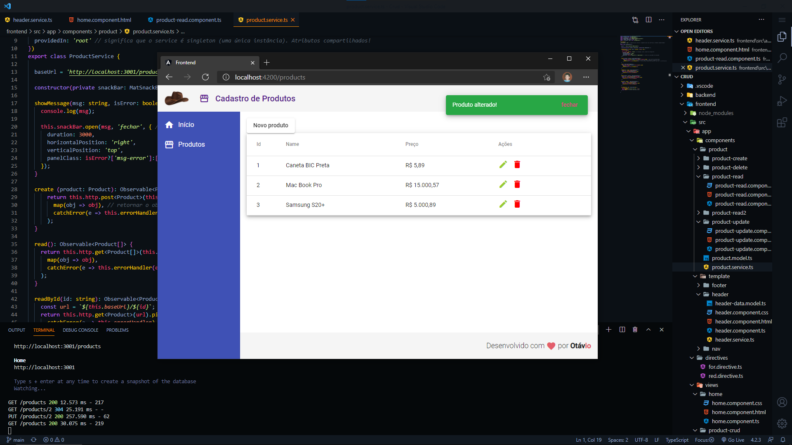

- Gerenciador de produtos simples, com backend em JSON Server
- Focado em desenvolver conceitos centrais do Angular, como:
  - Decorators, Directives (de atributo ou estruturais),
  - One Way Data Binding, Two Way Data Binding, Services,
  - Pipes, Router, Observables, Injeção de dependência, 
  - entre outros.
- Uso de classes do Material Design (`ng add @angular/material`) para a estilização dos componentes.
- Baseado no curso *Angular 9 - Essencial*, oferecido pela Cod3r Cursos.

